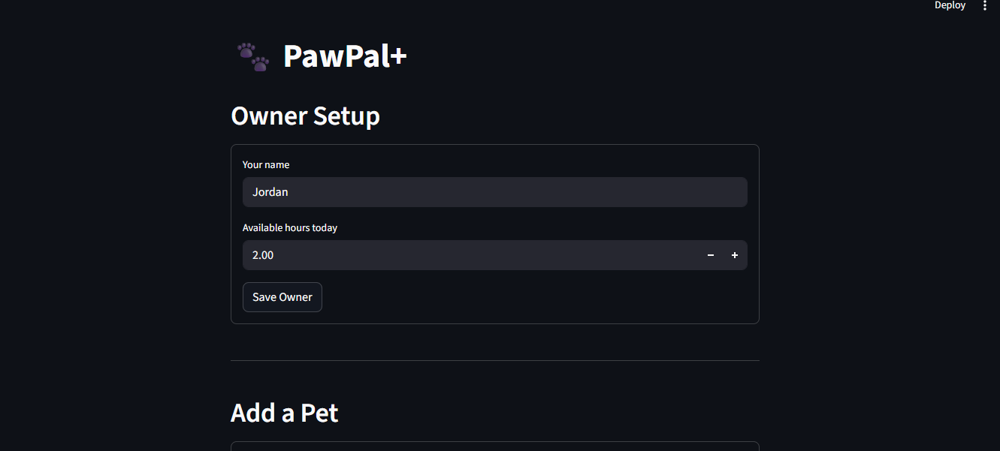

# PawPal+

A Streamlit app that helps pet owners build a daily care schedule across multiple pets — prioritizing tasks, detecting time conflicts, and automatically rescheduling recurring care.

---

## 📸 Demo




---

## Features

### Priority-based scheduling with duration tiebreaking
The scheduler sorts daily tasks by priority (high → medium → low) and uses duration as a tiebreaker when two tasks share the same priority — placing the shorter task first. This greedy approach maximizes the number of tasks that fit within the owner's available time window.

### Sorting by time window
Every scheduled task is assigned a `start_min` and `end_min` based on when it would run in sequence. The UI displays these time windows in a structured table so the owner sees exactly when each task would occur.

### Task filtering by status or pet
Tasks can be filtered by completion status, pet name, or both via `Owner.filter_tasks()`. Pending-only, completed-only, one-pet-only, or any combination — pets with no matching tasks are omitted from the result automatically.

### Daily and weekly recurrence
Marking a task complete via `Pet.complete_task()` automatically creates a new pending instance with a `due_date` advanced by the correct interval — 1 day for daily tasks, 7 days for weekly tasks — calculated using Python's `timedelta`. The original completed instance is preserved in history.

### Conflict warnings
`conflict_warnings()` compares time windows across all pet schedules and returns plain-English warning messages for any overlaps. Because each pet's schedule starts from minute 0, an owner with multiple pets can be double-booked — the app surfaces these as `st.error()` banners so they are impossible to miss.

### Per-schedule warnings
Each schedule tracks its own warnings during generation. If no tasks can be scheduled (all tasks exceed the time budget) or tasks are skipped due to insufficient time, a `st.warning()` banner appears automatically below that pet's schedule.

---

## Project structure

```
pawpal_system.py   — Core classes: Task, Pet, Owner, Schedule, conflict_warnings()
app.py             — Streamlit UI
main.py            — Terminal demo: sorting, filtering, rescheduling, conflict detection
tests/
  test_pawpal.py   — 16 pytest tests covering sorting, recurrence, and conflict detection
uml_diagram.md     — Final UML class diagram (updated to match implemented code)
reflection.md      — Design decisions, tradeoffs, and AI collaboration notes
```

---

## Getting started

### Setup

```bash
python -m venv .venv
source .venv/bin/activate   # Windows: .venv\Scripts\activate
pip install -r requirements.txt
```

### Run the app

```bash
streamlit run app.py
```

### Run the terminal demo

```bash
python main.py
```

### Run the tests

```bash
python -m pytest tests/test_pawpal.py -v
```

---

## How to use the app

1. **Owner Setup** — enter your name and how many hours you have available today.
2. **Add a Pet** — add one or more pets. Each pet tracks its own task list.
3. **Add a Task** — select a pet, then add tasks with a name, duration, frequency (daily/weekly), and priority. The task table always displays sorted by priority (high → low) with colored badges.
4. **Generate Schedule** — click to build today's plan. For each pet you will see:
   - Metrics showing available, scheduled, and remaining minutes
   - A table of scheduled tasks with their time windows
   - A collapsible panel of skipped or deferred tasks with reasons
   - Any per-pet warnings (e.g. time budget exceeded)
   - Cross-pet conflict warnings if the owner would be double-booked

---

## Scheduling algorithm

```
1. Pull all pending daily tasks for the pet.
2. Sort by priority (high → medium → low), then by duration ascending as a tiebreaker.
3. Greedily assign each task a start_min and end_min, stopping when the time budget is used.
4. Defer all weekly tasks to the excluded list.
5. Emit per-schedule warnings if tasks were skipped or nothing could be scheduled.
6. After all pets are scheduled, run conflict_warnings() across all schedules.
```

---

## Testing

**16 tests — all passing**

| Group | Tests | What is verified |
|---|---|---|
| Sorting | 4 | Priority order, duration tiebreaker, chronological time windows, budget overflow |
| Recurrence | 6 | Completion creates new instance, daily +1 day, weekly +7 days, `ValueError` on no pending match, rescheduled copy appears in next `generate()` |
| Conflict detection | 4 | Overlaps detected, single schedule returns `[]`, empty input returns `[]`, back-to-back tasks not flagged |

**Notable failure caught during testing**

`test_complete_task_raises_if_already_completed` initially failed because calling `complete_task()` twice succeeded — the first call creates a new pending copy, so the second call finds it. The fix was to use `task.mark_complete()` directly to produce a completed state without a rescheduled copy. This revealed that `mark_complete()` and `complete_task()` are not interchangeable.

**Confidence level: ★★★★☆ (4 / 5)**

Happy path is well-covered. Known gaps: multi-pet shared time budget is untested (each pet currently receives the full window independently), and no tests exercise month-boundary date rollovers.

---

## Design notes

The full design history — UML changes, tradeoffs, AI collaboration, and reflection — is documented in [reflection.md](reflection.md). The final class diagram is in [uml_diagram.md](uml_diagram.md).

**Key architectural decision:** tasks live on `Pet`, not on `Schedule`. The scheduler reads `pet.pending_tasks()` at generation time rather than holding its own copy. This means completing a task and rescheduling it is always reflected in the next `generate()` call without any extra wiring.
