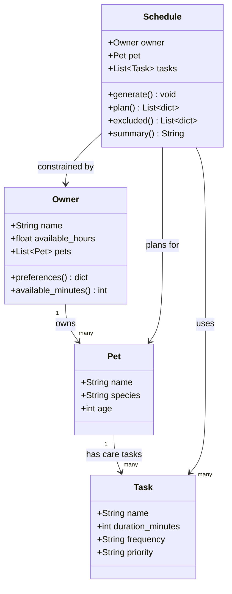

# PawPal+ UML Class Diagram

## Relationships

- **Owner → Pet** (1 to many): One owner can have multiple pets.
- **Pet → Task** (1 to many): One pet has multiple care tasks (feed, walk, meds, grooming, etc.)
- **Schedule → Owner**: The scheduler reads the owner's preferences (available hours) as constraints.
- **Schedule → Pet**: The schedule is generated for a specific pet belonging to the owner.
- **Schedule → Task**: The scheduler pulls from the pet's task list to build the plan.
