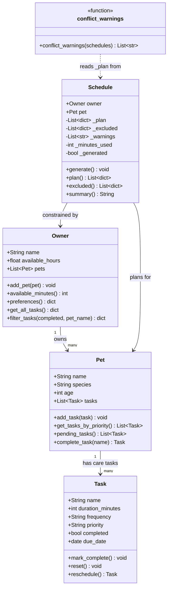

# PawPal+ UML Class Diagram

## Relationships

- **Owner → Pet** (1 to many): One owner can have multiple pets registered via `add_pet()`.
- **Pet → Task** (1 to many): Tasks live on the pet; `complete_task()` marks one done and appends a rescheduled copy.
- **Schedule → Owner**: `generate()` reads `owner.available_minutes()` as the time budget constraint.
- **Schedule → Pet**: The schedule is built exclusively from `pet.pending_tasks()` — it does not hold its own task list.
- **conflict_warnings → Schedule**: Module-level function that reads `_plan` entries (including `start_min`/`end_min`) from a list of schedules to detect time-window overlaps.

## Changes from Phase 1 UML

| What changed | Why |
|---|---|
| `Task` gained `completed`, `due_date`, and three methods | Needed for recurrence logic and `timedelta`-based rescheduling |
| `Pet` gained `tasks` attribute and three methods | Tasks must live on `Pet`, not float as a loose list passed to `Schedule` |
| `Owner` gained `add_pet()`, `get_all_tasks()`, `filter_tasks()` | Owner is the only class with visibility across all pets |
| `Schedule` lost `List~Task~ tasks` attribute | Schedule reads from `pet.tasks` directly — storing a separate copy would create drift |
| `Schedule` gained `_warnings`, `_minutes_used`, `_generated` | Internal state needed to support lazy generation and warning messages |
| `conflict_warnings` added as module-level function | Cross-schedule comparison does not belong to any single class |
